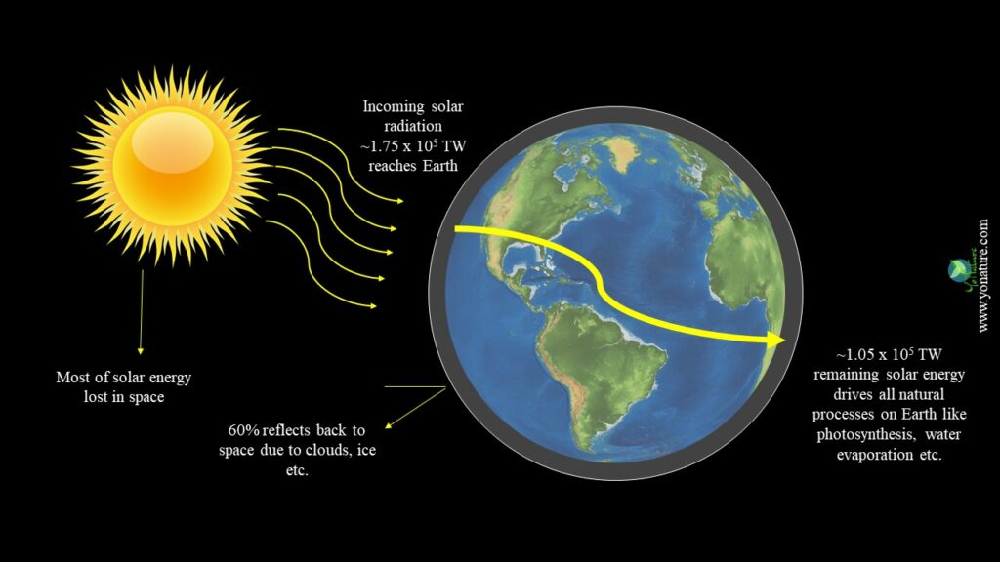

## Solar Radiation Forecasting with Edges Performance Analysis and Predict Solar Power Generation Using Machine Learning Models
<hr>


[](https://github.com/imsanjoykb/Text-Generation/LICENCE.txt)


[](https://github.com/imsanjoykb/sreAI/blob/master/Text_Generation.ipynb)



## Author: Sanjoy Biswas

Data Scientist | AI Researcher </br>
Website: https://imsanjoykb.github.io/ </br>
ResearchGate: https://www.researchgate.net/profile/imsanjoykb </br>
Linkedin: https://www.linkedin.com/in/imsanjoykb/ </br>
Email: sanjoy.eee32@gmail.com <br>

<hr>

## Abstract
```
In recent decades, the integration of solar energy sources has gradually become the main 
challenge for global energy consumption. Therefore, it is essential to predict global solar 
radiation in an accurate and efficient way when estimating outputs of the solar system. 
Inaccurate predictions either cause load overestimation that results in increased cost or 
failure to gather adequate supplies. However, accurate forecasting is a challenging task 
because solar resources are intermittent and uncontrollable. To tackle this difficulty, 
several machine learning models have been established; however, the forecasting 
outcomes of these models are not sufficiently accurate. Therefore, in this study, we 
investigate ensemble learning with square root regularization and intelligent optimization 
to forecast hourly global solar radiation. The main structure of the proposed method is 
constructed based on ensemble learning with a random subspace method that divides the 
original data into several covariate subspaces.
```

<hr>

## Project Installation

<b>Install the virtualenv package</b>
```
pip install virtualenv  
```
<b>Create the virtual environment</b>
```
virtualenv venv 
```
<b>Activate the virtual environment</b>
```
mypthon\Scripts\activate
```
<b>Install Dependencies</b>
```
pip3 install -r requirements.txt
```
<b>Run the text generation code which redirect userinterface of Gradio and the input of the text generate datafile</b>
```
python solar generation analysis.py
```
<b>After this, run main.py file which scale the data and connect with database to store data at DB</b>
```
python main.py
```
<b>Then run app.py file which shows all data and also Gradio </b>
```
python app.py
```

## Citing
```
@misc{Solar Radiation AI,
  author = {Sanjoy Biswas},
  title = {Solar Radiation Forecasting with Edges Performance Analysis and Predict Solar Power Generation Using Machine Learning Models.},
  year = {2021},
  publisher = {GitHub},
  journal = {GitHub repository},
  url="https://github.com/imsanjoykb/sreAI",
}
```